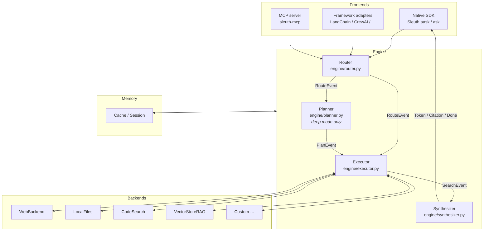

# Architecture

Sleuth routes every query through four sequential engine stages. Each stage emits events into the typed stream and hands off to the next.

---

## Overview



---

## Stage 1 — Router (`engine/router.py`)

The Router classifies the query depth heuristically — **no LLM call is made here**.

```python
class Router:
    def route(self, query: str, *, depth: Depth = "auto") -> RouteEvent:
        ...
```

When `depth` is `"fast"` or `"deep"` the caller's value passes through unchanged. When `depth="auto"` the Router applies keyword patterns and word-count heuristics: queries matching `_DEEP_KEYWORDS` (compare, tradeoffs, explain, versus, …) or exceeding ten words are routed to `"deep"`. Simple factual patterns (what / who / when / …) and very short queries go `"fast"`.

**Emits:** `RouteEvent(type="route", depth=..., reason=...)` — one per run.

---

## Stage 2 — Planner (`engine/planner.py`) — deep mode only

The Planner is invoked only when `resolved_depth == "deep"`. It calls the LLM once per iteration to decompose the query into sub-queries.

```python
class Planner:
    async def plan(
        self,
        query: str,
        state: _PlannerState,
        *,
        on_plan_event: Callable[[PlanEvent], Any] | None = None,
    ) -> AsyncIterator[PlanStep]:
        ...
```

The LLM is prompted to return a JSON array of `{"query": "...", "backends": [...]}` objects. The last object carries `"done": true` when the LLM considers the question answered.

**Reflect loop** (`engine/executor.py:reflect_loop`): The Planner and Executor alternate up to `max_iterations` times. Each iteration the Planner receives the prior search results as context (`_PlannerState.context_snippets`) and can refine or terminate. The loop stops when either the LLM says `done: true` or `max_iterations` is reached.

**Speculative prefetch** (`engine/executor.py:execute_with_prefetch`): Backend search starts on the first emitted `PlanStep` while the Planner is still streaming the rest, hiding planner latency behind search latency.

**Emits:** `PlanEvent(type="plan", steps=[PlanStep(...)])` — once per reflect iteration.

---

## Stage 3 — Executor (`engine/executor.py`)

The Executor fans the query (or sub-queries) out to **all backends in parallel** using `asyncio.gather`. Each backend call is wrapped in `asyncio.wait_for` with a per-backend timeout budget.

**Default timeout budgets** (from `DEFAULT_TIMEOUTS`):

| Capability | Timeout |
| --- | --- |
| `WEB`, `FRESH` | 8 s |
| `DOCS`, `CODE`, `PRIVATE` | 4 s |

The engine applies the backend's own `timeout_s` attribute if present (duck-typed; not in the frozen `Backend` protocol).

**Failure handling:** `BackendError` and `asyncio.TimeoutError` are caught per-backend. A `SearchEvent(error=...)` is emitted and that backend contributes zero chunks — the run continues with results from other backends.

**Cancellation:** each backend task runs as an `asyncio.Task`; if the caller cancels the outer `aask` generator, all pending tasks receive `CancelledError` and propagate it cleanly.

**Deduplication:** chunks from all backends are merged and deduplicated by `source.location` (first occurrence wins).

**Emits:** `SearchEvent(type="search", backend=..., query=..., error=None|str)` — one per backend call. A second `SearchEvent` with `error` set is emitted on failure.

---

## Stage 4 — Synthesizer (`engine/synthesizer.py`)

The Synthesizer assembles the merged chunks as context, prepends conversation history from `Session`, and calls `LLMClient.stream(messages, schema=...)`. It streams:

1. `ThinkingEvent` — when `llm.supports_reasoning is True` and the LLM emits `ReasoningDelta` chunks.
2. `TokenEvent` — for each `TextDelta` from the LLM.
3. `CitationEvent` — one per contributing chunk, emitted after the LLM stream closes.
4. `DoneEvent` — final event carrying `RunStats`.

After the stream completes, `Synthesizer.last_result` holds the assembled `Result[T]` that `ask()` returns.

---

## Cache layer

The cache intercepts between Router and Executor. On a cache hit:

1. A `CacheHitEvent` is emitted.
2. The cached text is replayed as a single `TokenEvent`.
3. Cached citations are replayed as `CitationEvent`s.
4. A `DoneEvent` is emitted with refreshed latency and incremented hit counters.

No backends are called on a cache hit. Schema-typed results bypass the cache (v0.1.0 limitation).

See [Caching & memory](caching.md) for the full cache layer design.

---

## Fast-path event ordering

```
RouteEvent(depth="fast")
SearchEvent(backend="tavily", query="...")
SearchEvent(backend="localfiles", query="...")   # parallel
TokenEvent(text="The ")
TokenEvent(text="answer ")
...
CitationEvent(index=0, source=...)
CitationEvent(index=1, source=...)
DoneEvent(stats=RunStats(...))
```

## Deep-mode event ordering

```
RouteEvent(depth="deep")
PlanEvent(steps=[PlanStep(query="sub-query 1"), PlanStep(query="sub-query 2")])
SearchEvent(backend=..., query="sub-query 1")
SearchEvent(backend=..., query="sub-query 2")
# ... possible second iteration:
PlanEvent(steps=[...])
SearchEvent(...)
TokenEvent(...)  ×N
CitationEvent(...)  ×K
DoneEvent(stats=RunStats(...))
```
